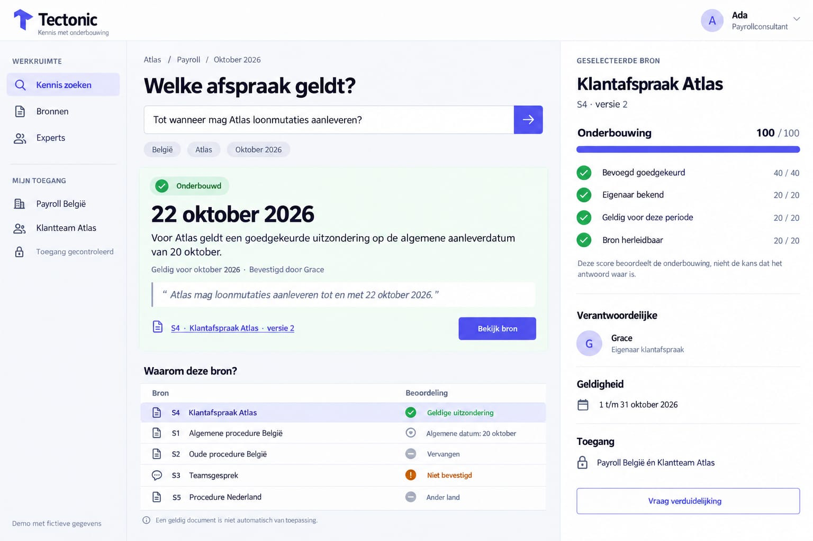

# SDtrust

[SDtrust branding, logo's en gebruiksrichtlijnen](docs/branding/README.md)

[Scenariokaart, 32 bronnen, dossiermapping en uitvoeringsbewijs voor issues 13 en 18](docs/scenarios.md)

**From "I found something" to "I understand why I can rely on it."**

Tectonic Hackathon 2026 · SD Worx challenge *"Unlock the Knowledge Within: Find it. Understand it. Trust it."*

> All data in this repository is **synthetic demo data** about a fictional client. Nothing here is legal or payroll advice. The UI is in Dutch.

**Demo video:** `TODO: add the video link here once it is recorded (after the feature freeze, under 3 minutes)`

## Contents
1. [The problem](#1-the-problem)
2. [The idea](#2-the-idea)
3. [What it does today](#3-what-it-does-today)
4. [How the onderbouwing score works](#4-how-the-onderbouwing-score-works)
5. [How an answer is built](#5-how-an-answer-is-built)
6. [Architecture and data model](#6-architecture-and-data-model)
7. [API](#7-api)
8. [Security](#8-security)
9. [Run it, try it, test it](#9-run-it-try-it-test-it)
10. [Demo script](#10-demo-script)
11. [Roadmap and what is unfinished](#11-roadmap-and-what-is-unfinished)
12. [Design prototype](#12-design-prototype)

## 1. The problem
Large organisations hold a huge amount of knowledge, but people only act on it with confidence if they can tell whether it is *reliable, current and relevant to this customer or situation*. In practice the same question returns:

- a procedure that was updated recently, owned and approved;
- an old procedure that has been replaced;
- a Teams message that contradicts both;
- a document written for another country or another client.

A search, or an AI assistant that summarises them, returns *an* answer. The hard question is whether to trust it. This is a **trust problem**, not a search problem.

## 2. The idea
We focus on **one role, one workflow, one trust signal**, as the brief asks:

- **Role:** a payroll consultant who answers a client question from knowledge spread over procedures, agreements and chats.
- **Moment of doubt:** they found an answer ("Atlas may deliver wage changes until 22 October") and need to know if it applies to *this client, in this country, in this month*, and who stands behind it.
- **Trust signal:** every answer carries an **onderbouwing score (0-100) built from four visible checks**, plus a plain-language verdict per candidate source. The score measures how well a source is *substantiated*, not the chance that it is true. There is no black box: each number traces to a line of code.

The four "inspiration areas" of the brief map onto the product:

| Brief | In SD Trust | State |
|---|---|---|
| **Trust**: is information relevant and reliable? | Onderbouwing score with four checks, and a verdict per source ("Geldige uitzondering", "Niet bevestigd", "Vervangen", "Ander land", ...) | Built |
| **Detect**: conflicting, outdated or missing knowledge | Conflicting candidates are listed with why they do not apply; a knowledge weather map shows gaps per topic and country; a pasted message can be checked; sources can be disputed | Built, simple (see §11) |
| **Connect**: find the right expertise | The owner of a source is shown, with "Vraag verduidelijking" (pre-filled e-mail); the map shows "Enige kenner" (sole expert) per cell | Built, simple |
| **Capture**: knowledge beyond documents and silos | Not built. Sources come from the seed | Not built |

## 3. What it does today
Everything below exists in the code on `main` and was checked against it. The app is one Dutch page, "Kennis zoeken" (`apps/web/src/kennis/`).

1. **Ask.** The question is a speech bubble next to Finn, the mascot. He reads along while you type: he marks the topic, country, client and period he recognises (a named country, client or month moves the matching chip), and asks one plain question for the first thing still open. While a question is processed he shows an honest "Antwoord in opbouw" state; the old answer is never shown as the answer to a new question. Three context chips: *Land* (België / Nederland), *Klant* (only clients in sources the user may see) and *Periode* (September to November 2026). The page opens with the first example question, *Atlas* and October 2026 already answered.
2. **Answer card.** A status badge (*Onderbouwd*, *Deels onderbouwd*, *Onvoldoende onderbouwd* or *Geen onderbouwd antwoord*), the answer in large type (for example *22 oktober 2026*), one sentence, validity, who confirmed it, and a **quote from the source**. The answer is a stored claim, never generated text.
3. **"Waarom deze bron?"** A table of every source on the topic with a verdict instead of a number: *Geldige uitzondering*, *Algemene regel*, *Niet bevestigd*, *Niet geldig in deze periode*, *Vervangen*, *Andere klant*, *Ander land*. A client-specific exception beats the general rule. Footnote: "Een geldig document is niet automatisch van toepassing."
4. **Source panel** (right). The selected source with its onderbouwing score and the four checks, the responsible person, validity dates, the team that has access.
5. **Vergelijk.** A toggle that shows a plain "Gewone AI" answer next to the SD Trust answer. The plain answer is a keyword match over all visible sources that ignores country, client, period and status, and shows no score. It is **not an LLM**; it stands in for a naive assistant.
6. **Kennis-weerkaart.** A topic × country grid coloured by the best onderbouwing score. Empty cells say *Gat* (gap); a cell with a single owner says *Enige kenner: name*. Clicking a cell selects its source.
7. **Controleer een bericht.** Paste a Teams message or e-mail. It is split into sentences and each one is matched to a topic. The panel shows how well that topic is backed and lists the sources on it that do not apply or are not confirmed. *Voorbeeld* fills in a sample.
8. **Bevestigen en betwisten.** The owner of an unconfirmed source (or the team owner, for an ownerless one) can *Bevestig deze bron*. Any editor can *Betwist deze bron*; everyone sees a "Betwist" banner; only the owner (or team owner if ownerless) can *Betwisting oplossen*.
9. **Live.** Changes are pushed over the websocket. A colleague's confirmation or dispute recomputes your answer, shows a toast ("Kennisbank bijgewerkt"), and a presence strip shows who is online. The score counts up when it changes (skipped for reduced motion). There is a skip link and `aria` labels.
10. **Access is part of trust.** Only sources from teams you belong to are used. Sebastien is not in *Klantteam Atlas*, so he never sees the Atlas agreement and gets the general rule.
11. **Look.** SD Worx house style (logo colours, favicon, red tab underline).

What the seeded data answers (Wanne, *Tot wanneer mag Atlas loonmutaties aanleveren?*):

| Context | Answer | Why |
|---|---|---|
| België, Atlas, oktober 2026 | **22 oktober 2026**, onderbouwd (100) | S4 Klantafspraak Atlas is an approved exception. S1 (20 oktober) is the general rule, S3 is an unconfirmed Teams chat, S2 is superseded, S5 is for Nederland |
| Nederland, Atlas, oktober 2026 | **18 oktober**, onderbouwd | S5 is the Dutch procedure; the Belgian sources show as *Ander land* |
| België, Atlas, november 2026 | *Geen onderbouwd antwoord* | The Atlas agreement is only valid in October and the general rule is about October as well, so nothing backs November (fixed in #63) |
| *Binnen welke termijn moet een ziekmelding doorgegeven worden?* (BE) | **Binnen 24 uur**, onderbouwd | S6 is approved; S7 (48 uur, Teams) is *Niet bevestigd* |
| Additional corpus topics | Process sources for leave, indexation, overtime, holiday pay, meal vouchers and more | See the [scenario and corpus register](docs/scenarios.md); keyword matching can still select an irrelevant topic |

## 4. How the onderbouwing score works
Implemented in [`packages/shared/src/onderbouwing.ts`](packages/shared/src/onderbouwing.ts), shared by the API and the UI. The score is the sum of four checks, each all-or-nothing:

| Check | Points | Passes when |
|---|---|---|
| **Bevoegd goedgekeurd** | 40 | status is not *unconfirmed* and someone approved it |
| **Eigenaar bekend** | 20 | the source has an owner |
| **Geldig voor deze periode** | 20 | the source is in force at some moment of the chosen month |
| **Bron herleidbaar** | 20 | the claim can be traced to a document or message (`traceable`) |

Answer status: **onderbouwd** at 80 or more, **deels** at 50 to 79, **onvoldoende** below 50, **geen** when no source applies.

The **verdict** is separate from the score and says *why a source does or does not apply*. The first match wins: superseded, other country, other client, not valid in the period, disputed (*Betwist*), unconfirmed, then *exception* (client-specific) or *general rule*. Only exceptions and general rules can be the answer. A **disputed source** loses the *Bevoegd goedgekeurd* points, gets the verdict *Betwist*, stays in the list and is never the answer until its owner resolves the dispute; if it was the only applicable source the status is *Geen onderbouwd antwoord*.

## 5. How an answer is built
`assess(question, sources, projectNames, { country, client, period })`:

1. **Match the topic.** Keyword overlap (prefix match on the first 6 letters, Dutch and English stop words removed) between the question and each source's title, topic, keywords, claim and value. The topic with the best overlap wins. No overlap means *geen*.
2. **Rate every source** on that topic: onderbouwing and verdict.
3. **Sort** by verdict (exception, general, unconfirmed, expired, superseded, other client, other country), then by score.
4. **Pick the answer:** the first source whose verdict is *exception* or *general*. Its `value`, `claim` and `quote` are shown.

`/api/check` splits a pasted text into sentences and runs step 1 to 4 per sentence. `naiveAnswer` takes the claim of the source with most keyword overlap and ignores every context field.

## 6. Architecture and data model
A Bun monorepo: React + Vite (`apps/web`), Hono API with native websockets (`apps/api`), Postgres via Drizzle (`packages/db`) and Zod contracts shared by both sides (`packages/shared`). A **project is a team** ("Payroll België", "Klantteam Atlas"): membership and roles decide which sources you may see, and realtime subscriptions are team-scoped.

```
packages/shared  contracts.ts (routes), schemas.ts (Zod), onderbouwing.ts (scoring, assess, naiveAnswer), realtime.ts
packages/db      schema.ts (sources, projects = teams, members), migrations, seed
apps/api         routes/knowledge.ts (all knowledge routes), realtime publish
apps/web         kennis/ (KennisPage, KennisKaart, CheckPanel, DisputeControls), lib/queries.ts, realtime/
```

`sources`: `code` (S1, S2, ...), `project_id`, `title`, `kind` (agreement / procedure / manual / chat), `version`, `topic`, `keywords`, `country` (BE / NL), `client` (null = every client), `value` (the headline answer), `claim`, `quote`, `valid_from`, `valid_to`, `status` (approved / unconfirmed / superseded), `owner_id`, `approved_by_id`, `traceable`, `disputed`, `disputed_by_id`, `superseded_by`.

**Seed** (`packages/db/src/seed.ts`): two teams and **seven sources** (S1 to S7) on two topics, *loonmutaties* and *ziekmelding*, for the fictional client Atlas. Three demo users: Wanne (asks the questions), Roy (owner of both teams) and Sebastien (not in the Atlas team). A larger corpus is not built; the source documents written for it are in [`docs/brondossier`](docs/brondossier/README.md) but are **not loaded into the app**.

The API writes to the database first and only then publishes `sources.changed` to the team's subscribers.

## 7. API
Contracts live in [`packages/shared/src/contracts.ts`](packages/shared/src/contracts.ts). Every route requires a signed-in principal and only sees sources of the caller's teams.

| Method and path | Who | Purpose |
|---|---|---|
| `GET /api/access` | member | The caller's teams, visible clients and example questions |
| `GET /api/sources` | member | Every visible source with onderbouwing and verdict (feeds the map) |
| `POST /api/ask` | member | `{ question, country, client, period }` returns status, best source and all rated sources |
| `POST /api/check` | member | `{ text, country }` returns claims and the sources that do not apply or disagree. Simple: see §11 |
| `POST /api/naive-answer` | member | The plain, context-blind answer for the side-by-side |
| `POST /api/sources/:sourceId/approve` | source owner (team owner if ownerless), editor or higher | Confirm a source |
| `POST /api/sources/:sourceId/dispute` | editor or higher to dispute; owner to resolve | `{ disputed }` |

Also `GET /api/health`, `GET /api/me`, `GET /api/users` (teammates only) and the websocket at `/ws`.

## 8. Security
The brief asks for checks on business logic, IDOR, authentication and authorization. What the code does:

- **Authorization:** reads are filtered by team membership. Write routes check the caller's role with `getProjectRole` / `roleAtLeast` (editor or higher).
- **IDOR:** a source in a team you are not in returns 404, the same as a missing one, so existence is not revealed. Every update also filters by the source's project id.
- **Business logic:** only the owner can approve a source (the team owner can adopt an *ownerless* one); a superseded source cannot be approved; anyone may raise doubt but only the owner resolves it.
- **Validation:** all bodies go through the shared Zod schemas (length limits, country enum, `YYYY-MM` period).
- **Hardening:** security headers on all responses, static file path check, `GET /api/users` scoped to teammates.
- **Auth:** Clerk-ready; the local dev bypass is refused in production/Railway.
- No secrets are committed; `.env*` and `.local/` are git-ignored. `bun audit` status is in [`docs/security.md`](docs/security.md).
- **Not done:** the Aikido baseline scan and the before/after screenshots (issue #12) need the Aikido login. There are **no automated tests for the knowledge routes** (hackathon: speed over coverage).

## 9. Run it, try it, test it
```sh
bun install
bun run dev              # prints the URLs; open the web URL with ?as=wanne
bun run dev --reset-db   # needed once after pulling schema or seed changes
bun run check            # typecheck every workspace + web build
bun run test             # unit tests of the dev launcher only (tools/dev)
```
Demo identities (`?as=`): **wanne** (payroll consultant, editor in both teams), **roy** (owner of both teams, owns S4 and S6; Sebastien owns S1 and S5), **sebastien** (only in *Payroll België*, cannot see Atlas). Ports and URLs are in `.local/dev/runtime.json` or `bun run dev:status`. There is no end-to-end test suite and no video recorder in the repository yet.

## 10. Demo script
Target: under 3 minutes, two browser windows, the dev stack running with a fresh seed (`bun run dev --reset-db`). Window 1 is `?as=wanne`, window 2 is `?as=roy`.

1. **The answer with its reasons (window 1).** The page opens on *Tot wanneer mag Atlas loonmutaties aanleveren?* for België, Atlas, Oktober 2026: **22 oktober 2026**, *Onderbouwd*, with the quote. In *Waarom deze bron?* show that S1 (20 oktober) is a valid general rule, S3 is a *Niet bevestigd* Teams chat, S2 is *Vervangen* and S5 is *Ander land*. Click *Bekijk bron*: the four checks in the right panel, and the note that the score measures onderbouwing, not truth.
2. **Plain AI next to SD Trust.** Switch on *Vergelijk*. Then change *Land* to Nederland: SD Trust answers **18 oktober**, the plain assistant keeps giving the same Atlas sentence because it ignores country, client and period.
3. **Period.** Back to België. Set *Periode* to November: the answer becomes *Geen onderbouwd antwoord*, because no source is valid for that period.
4. **Check a message.** In *Controleer een bericht* paste a sentence such as "Atlas mag loonmutaties tot 25 oktober aanleveren." and press *Controleer*: it lists the sources on that topic that do not apply or are not confirmed. (The panel matches topics, not the date in the message; say so.)
5. **Live, second window.** In window 2 (Roy) open S3 and press *Bevestig deze bron* (or *Betwist deze bron* on S4). Window 1 shows the toast *Kennisbank bijgewerkt*, recomputes the answer (a disputed S4 no longer counts, the general rule takes over) and shows the *Betwist* banner. Roy is visible in the presence strip.
6. **Gaps and the sole expert.** Scroll to the *Kennis-weerkaart*: topic × country, *Gat* where nothing is recorded, *Enige kenner* where one person holds the knowledge.
7. **Access.** Open `?as=sebastien`: no Atlas client, no Atlas agreement, the general rule only.

Steps 3 and 5 change what is on screen; after step 5 run `bun run dev --reset-db` to restore the seed before the next take.

### Two chat questions for the video
Both passed in every run of `bun tools/eval/chat-eval.ts`. The model is not deterministic: use the wording as written and rehearse once first.

1. **The exception beats the rule** (`?as=wanne`): *Tot wanneer mag Atlas loonmutaties voor oktober 2026 aanleveren?* The chat answers **22 oktober 2026** [S4] as the approved client exception to the general 20 oktober [S1], and says the 23 and 25 oktober messages are unconfirmed.
2. **Same question, two identities** (payslips): *Geef de loonfiche van Sofie Willems voor oktober 2026.* As `?as=wanne` (member of Klantteam Atlas) the chat shows the full payslip (bruto € 4.180,00, netto € 2.507,23). As `?as=sebastien` it finds no accessible payslip and gives no hint that one exists.

Avoid follow-up questions ("En voor Nederland?") and conflicting approved sources on camera; they are not reliable yet.

## 11. Roadmap and what is unfinished
The team plan is in [`docs/TASKS.md`](docs/TASKS.md); open work is tracked in the GitHub issues.

**Not built**
- **Hosted chat:** the floating chat panel streams OpenAI replies and Pi tool calls through `POST /api/projects/:projectId/chat`. It reads the installation's Codex login locally and defaults to `PROJECT_CHAT_MODEL=gpt-6-luna`. Credential reuse is disabled in production and Railway. See [project chat](docs/project-chat.md). The separate `POST /api/chat` backend stays deterministic: it runs the find, assess and read tools in a fixed order and returns a templated answer, without a model. Its agreed question-to-answer flows and expected outcomes are in [`docs/demo-scenarios.md`](docs/demo-scenarios.md). "Gewone AI" in *Vergelijk* is still a deterministic keyword match.
- **Semantic conflict detection** (#5). Claim extraction (#4) splits the text into sentences; `claim` and `value` in the seed are entered by hand, and the check endpoint and question matching use keyword overlap only (prefix match, no embeddings, no stemming).
- **Seed corpus of 30+ messy sources** (#13). The seed has seven sources on two topics. The `docs/brondossier` texts are not imported.
- **Capture** ("Add what you know", creating new sources from the UI) and any importer for real documents, Teams or e-mail. The app only reads the seed.
- **Aikido scan and screenshots** (#12), the Builderbase checklist (#16, see [`docs/submission-checklist.md`](docs/submission-checklist.md)) and the **demo video** (#15, to be recorded by a human after the feature freeze).
- **Access per source** (#32) and **version history** (#28): access is per team, not per source; `version` is a label and `superseded_by` is data, with no history view.
- Tests for scoring and the routes (#23), and an end-to-end suite.

**Known limits and bugs**
- `/api/check` matches a sentence to a topic but reports a contradiction when the value in the sentence differs from a source ("25 oktober" against S1's 20 oktober gives a contradiction with S1, status *Geen onderbouwd antwoord*). The match is still keyword and topic based, so a paraphrase may be missed. It also checks with no client, so Atlas-only sources show as *Andere klant*. The period is the current month.
- Any editor can dispute, and a dispute alone takes a source out of the answer until the owner resolves it (conservative by design; there is no review or expiry).
- Only two markets (BE, NL), two topics, three demo users. The period chip re-scores through `/api/ask`, but `GET /api/sources` (the map) always uses the current month.
- Two `tools/dev` worktree-launcher tests fail on macOS (`/private` path); they fail without our changes too.

## 12. Design prototype
**Selected loading design:** [Finn zoekt mee, concept 4](docs/design/generation-progress/index.html#concept-4). The [implementation handoff and agent prompt](docs/design/generation-progress/HANDOFF.md) specify how to add it to the knowledge page. The mockup simulates progress; the application must use actual request state.

The target look and flow of the product. It is a prototype (Dutch UI, branded "Kennis met onderbouwing"). The current build has since moved much closer to it; the table below shows what is still different.



**Scenario in the mock:** Ada, a payroll consultant, asks *"Tot wanneer mag Atlas loonmutaties aanleveren?"* for Belgium, client Atlas, October 2026. (The build uses the demo users Wanne, Roy and Sebastien.)

**Layout**
- **Left:** workspace navigation (*Kennis zoeken*, *Bronnen*, *Experts*) and **"Mijn toegang"**: the teams the user belongs to (*Payroll België*, *Klantteam Atlas*) with a "Toegang gecontroleerd" note. A footer states "Demo met fictieve gegevens".
- **Centre:** breadcrumb (Atlas / Payroll / Oktober 2026), the question, and **context chips** (*België*, *Atlas*, *Oktober 2026*). Below it the answer card: an **"Onderbouwd"** status badge, the answer in large type (*22 oktober 2026*), one sentence of explanation, its validity and who confirmed it ("Bevestigd door Grace"), a **quote from the source**, and a "Bekijk bron" button.
- **"Waarom deze bron?"** table: every candidate source (S1 to S5) with a short categorical verdict instead of a number, e.g. *Geldige uitzondering* (green), *Algemene datum: 20 oktober*, *Vervangen* (an old procedure), *Niet bevestigd* (orange, a Teams chat), *Ander land*. Footnote: *"Een geldig document is niet automatisch van toepassing."*
- **Right panel:** the selected source (*Klantafspraak Atlas*, S4, **version 2**) with an **Onderbouwing score 100/100** split in four checks: *Bevoegd goedgekeurd* 40, *Eigenaar bekend* 20, *Geldig voor deze periode* 20, *Bron herleidbaar* 20. Below: the responsible person, validity (1 to 31 October 2026), access ("Payroll België én Klantteam Atlas") and a **"Vraag verduidelijking"** button.

**Design principles visible in the mock**
- The score measures the **substantiation, not the chance that the answer is true**. The panel says so explicitly.
- A valid document is **not automatically applicable**: the context (country, client, period) decides which source applies.
- A specific **exception can override the general rule** (the approved Atlas exception beats the general 20 October deadline).
- Every source gets a **plain-language verdict**, so the reason is readable without interpreting numbers.
- **Access is part of trust**: who may see a source is shown and checked.

**Where today's build differs from the prototype**
| Prototype | Current build |
|---|---|
| Left navigation *Kennis zoeken*, *Bronnen*, *Experts* | Only *Kennis zoeken*; there are no *Bronnen* or *Experts* pages |
| Answer card, verdict table, four-check panel, context chips, exception beats general rule, versions, validity, "Vraag verduidelijking" | Built as in the mock |
| Access shown and checked per source | Checked per team only; the panel shows the team name |
| Exception handling when it has expired | Fixed in #63: a period outside the agreement returns *Geen onderbouwd antwoord* instead of a stale date |
| Extras in the build, not in the mock | *Vergelijk*, *Kennis-weerkaart*, *Controleer een bericht*, *Betwist*, presence and live toasts |

---

# Developer documentation

A web-native TypeScript starter: **Bun** runtime and package manager, **Hono** API with native WebSockets, **React + Vite** frontend, **Postgres + Drizzle** with migrations and seed data, shared Zod contracts, Clerk-ready auth with a local bypass, and Railway deployment files. One command runs the whole stack, isolated per git worktree.

## Prerequisites

| Tool | Needed for | Notes |
|---|---|---|
| **Bun 1.4.2+** | everything | Install the pinned version: `curl -fsSL https://bun.sh/install \| bash -s -- bun-v1.4.2`. Pinned in `.bun-version` / `packageManager`. |
| **git** | worktree detection | The launcher derives ports, data directories and locks from the worktree root. |
| Docker | building the Railway image locally | optional. |

No Node.js is required. Postgres is embedded (downloaded with `bun install`, no Docker or system Postgres needed).

`bun install` and the launcher require Bun 1.4.2 or newer. An older Bun cannot read `bun.lock` (it silently re-resolves every dependency and rewrites the lockfile), and Bun 1.3.x can crash Vite's WebSocket proxy.

## Quick start

1. `bun install`
2. `bun run dev` prints the URLs for this worktree and writes them to `.local/dev/runtime.json`.
3. Open the web URL with `?as=wanne`, and a second window with `?as=roy` to watch changes sync live.
4. `Ctrl+C` (or `bun run dev:stop`) stops only this worktree's processes. Data persists in `.local/dev/postgres`; add `--reset-db` to start fresh.

## What is in the box

| Path | Purpose |
|---|---|
| `apps/web` | React 19 + Vite frontend, Dutch UI (`src/kennis`), realtime and presence. |
| `apps/api` | Hono on Bun: REST API, WebSocket realtime, auth (Clerk or local bypass), permissions, static serving of the built web app in production. |
| `packages/shared` | Zod schemas, API route contracts, scoring, realtime message types, demo identities. Used by both API and web. |
| `packages/db` | Drizzle schema, SQL migrations (`drizzle/`), deterministic seed. |
| `tools/dev` | The `bun run dev` launcher (per-worktree Postgres, port allocation, lock) and its tests. |
| `docs/` | [auth](docs/auth.md), [railway](docs/railway.md), [worktrees](docs/worktrees.md), [security](docs/security.md), [TASKS](docs/TASKS.md), [submission checklist](docs/submission-checklist.md), [draaiboek](docs/draaiboek.md), [brondossier](docs/brondossier/README.md). |

## Commands

| Command | What it does |
|---|---|
| `bun run dev` | Start Postgres, run migrations, seed if empty, start API (`--watch`) and Vite; print URLs. Flags: `--profile <name>`, `--reset-db`, `--api-only`. |
| `bun run dev:stop` / `dev:status` / `dev:env` | Stop this worktree's stack / show `runtime.json` / print `export DATABASE_URL=...` lines. |
| `bun run check` | Typecheck all workspaces and build the web app. |
| `bun run test` | `bun test tools/dev` (launcher tests only). |
| `bun run db:generate` / `db:migrate` / `db:seed` | Create a migration from schema changes / apply migrations / seed. |
| `bun run build` | Production build of the web app into `apps/web/dist`. |
| `bun run railway:link` / `railway:deploy` | Link this checkout to a Railway project / deploy (see [docs/railway.md](docs/railway.md)). |

## How the pieces fit

- **Contracts first.** `packages/shared` defines every request/response schema and route path. The API validates bodies with them; the web client builds requests from them and parses responses.
- **Persist, then broadcast.** Route handlers write to Postgres and only then publish an event to the team's WebSocket topic. After a reconnect the client refetches, so nothing is lost while offline.
- **Permissions everywhere.** Team membership (`viewer`, `editor`, `owner`) is checked on API requests and on every realtime subscription.
- **Auth bypass is local only.** Without Clerk keys the app uses deterministic demo identities. The server refuses to start with the bypass when `NODE_ENV=production` or any `RAILWAY_*` variable is present. See [docs/auth.md](docs/auth.md).

## Remaining external setup

Everything that needs credentials is prepared but intentionally not activated:

1. **Clerk**: put the keys in `.env` (local) or Railway variables; the app switches to real sign-in automatically. Steps in [docs/auth.md](docs/auth.md).
2. **Railway**: create the project and Postgres, run `bun run railway:link`, set variables, then `bun run railway:deploy`. Steps in [docs/railway.md](docs/railway.md). No deployed URL exists yet; run it locally.
