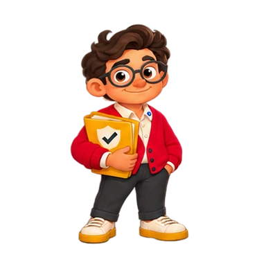

# Finn: fluid gestures

Four newly generated animation sequences, interpolated at 30 fps: welcome, listening, thinking and answer. Each has an animated WebP, a transparent GIF and a static PNG. They loop for review. `animations.json` records timings.

Display at 330 by 330 CSS pixels for a character approximately 275 pixels tall, matching the reference screenshot. Prefer WebP for alpha edges. Use the PNG when reduced motion is requested.

```html
<picture>
  <source media="(prefers-reduced-motion: reduce)" srcset="welcome.png">
  
</picture>
```

The character artwork was generated using the built-in image_gen tool. Source sheets, exact prompts and the RIFE v4.6 interpolation/encoding script are in `docs/design/mascot-concepts/finn/fluid/`. These are generated sprite animations; some drawing variation remains. An answer gesture does not imply a verified answer.
