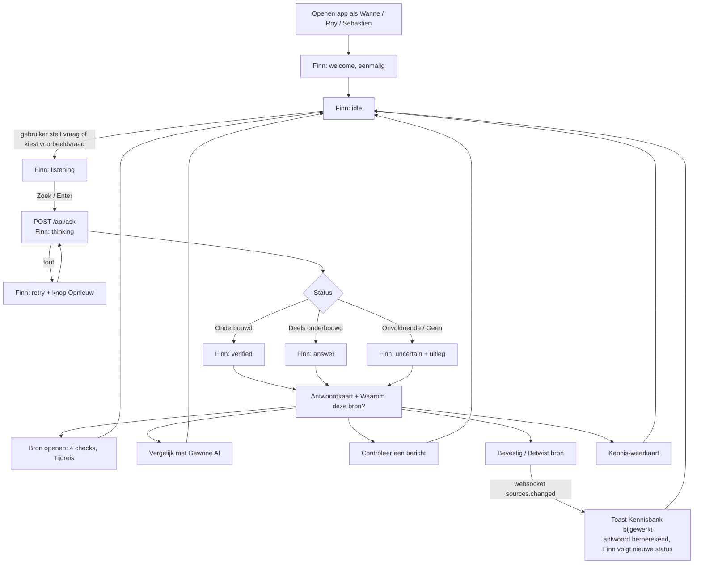

# Applicatieflow met Finn

Hoe een gebruiker door SD Trust ("Kennis zoeken") loopt en waar de mascotte **Finn** op reageert. Finn is **nog niet gebouwd**; dit document is de specificatie. De animaties staan in [`design/mascot-concepts/finn`](design/mascot-concepts/finn/README.md) (8 states, `manifest.json`). Het chatbackend (`POST /api/chat`, #20) bestaat, de chat-UI (#21, #22) is het aanknopingspunt voor Finn.

## Principes

- Finn **begeleidt**, hij beslist niet. De onderbouwing komt uit `assess()` in `packages/shared/src/onderbouwing.ts`, nooit uit Finn.
- Status staat nooit alleen in de mascotte: elke Finn-state heeft altijd zichtbare tekst (badge, toast of bericht).
- *Verified* alleen bij status **Onderbouwd** (score ≥ 80) of een expliciete bevestiging door een eigenaar. *Answer* betekent: antwoord er, niet geverifieerd.
- Geen geluid, chat opent nooit vanzelf, Welcome speelt één keer per browsertab-sessie.
- `prefers-reduced-motion`: toon het statische representatieve frame van de state.

## Finn-states

| State | Wanneer |
|---|---|
| `welcome` | Eerste bezoek in de sessie, één keer |
| `idle` | Rust; chat beschikbaar, geen lopende aanvraag |
| `listening` | Chat geopend of gebruiker typt (niet per toetsaanslag) |
| `thinking` | `POST /api/ask`, `/api/check` of `/api/chat` loopt; stopt zodra het antwoord er is |
| `answer` | Antwoord klaar, status *Deels onderbouwd* |
| `verified` | Status *Onderbouwd*, of bron net bevestigd |
| `uncertain` | *Onvoldoende*, *Geen onderbouwd antwoord*, conflicterende bronnen, betwiste bron |
| `retry` | Request of websocket faalt; zichtbare "Opnieuw proberen" |

## Hoofdflow

## Stappen en Finn-reacties

| # | Gebruikersactie | Systeem | Finn | Zichtbare tekst (altijd aanwezig) |
|---|---|---|---|---|
| 1 | Opent de app (`?as=wanne`) | `GET /api/me`, `/api/access`; realtime `/ws` verbindt | `welcome` → `idle` | "Hoi, ik ben Finn. Vraag maar wat je wilt weten, ik laat zien waarop het antwoord rust." |
| 2 | Kiest context: Land, Klant, Periode | Klantenlijst = enkel klanten uit bronnen van eigen teams | `listening` | Chips tonen de gekozen context |
| 3 | Typt of kiest voorbeeldvraag | Niets (geen call per toetsaanslag) | `listening`, hold | - |
| 4 | Verstuurt de vraag | `POST /api/ask { question, country, client, period }` | `thinking` | "Ik controleer de bronnen…" |
| 5a | Status *Onderbouwd* (bv. België, Atlas, oktober: 22 oktober 2026) | Antwoordkaart + bronnentabel | `verified` → `idle` | Badge "Onderbouwd", "Gebaseerd op Klantafspraak Atlas (S4)" |
| 5b | Status *Deels onderbouwd* | Idem | `answer` → `idle` | "Dit antwoord rust maar deels op goedgekeurde bronnen." |
| 5c | *Onvoldoende* of *Geen onderbouwd antwoord* (bv. november) | Geen antwoord; kandidaten getoond | `uncertain`, hold | "Geen bron is geldig voor november. Vraag verduidelijking aan de eigenaar." |
| 5d | Request faalt | - | `retry`, hold | "Dat lukte niet." + knop *Opnieuw proberen* |
| 6 | Opent "Waarom deze bron?" en klikt *Bekijk bron* | Rechterpaneel: score, 4 checks, eigenaar, geldigheid, toegang | blijft `idle` | Score meet onderbouwing, niet waarheid |
| 7 | Sleept **Tijdreis** naar november | Browser herberekent score; geen API-call | `uncertain` als score onder 80 valt, anders ongewijzigd | "In november verloopt deze bron." |
| 8 | Zet **Vergelijk** aan, wisselt Land naar Nederland | `POST /api/naive-answer` (zelfde body als `/api/ask`: vraag, land, klant, periode) naast `/api/ask` | `answer` | "Gewone AI negeert land, klant en periode." SD Trust: 18 oktober |
| 9 | Plakt een Teams-bericht in **Controleer een bericht** | `POST /api/check { text, country }` | `thinking` → `uncertain` bij `contradictions` (ook als `claims[].status` = `geen`), `verified` alleen als de zin gedekt is zonder tegenspraak | "Deze zin spreekt S1 tegen (20 oktober)." |
| 10 | Klikt *Vraag verduidelijking* | Mail vooringevuld naar de bronhouder | `answer`, kort | "Mail aan Roy staat klaar." |
| 11 | Roy (bronhouder) klikt *Bevestig deze bron* (window 2); Wanne krijgt 403 "Only the owner…" en Finn toont dan `retry` niet, maar `uncertain` met "Alleen de bronhouder kan dit bevestigen" | `POST /api/sources/:id/approve` → DB → `sources.changed` | Bij Wanne: antwoord herberekend, Finn volgt de nieuwe status | Toast "Kennisbank bijgewerkt" |
| 12 | Editor klikt *Betwist deze bron*; alleen de bronhouder kan de betwisting oplossen | `POST /api/sources/:id/dispute` → DB → publish | `uncertain` zolang de beste bron `disputed` is, ook als `status` nog `onderbouwd` is | Banner "Betwist"; score en status veranderen nog niet (README §11) |
| 13 | Scrolt naar **Kennis-weerkaart**, klikt een cel | `GET /api/sources` | `idle`; bij lege cel `uncertain` | "Gat: niemand heeft dit vastgelegd." of "Enige kenner: …" |
| 14 | Sebastien opent de app | Geen Atlas-team: `clients` is leeg, bronnen S1, S2, S5 zichtbaar, antwoord de algemene regel (20 oktober) | `welcome` → `idle` | "Je ziet alleen de algemene regel. Atlas-afspraken zijn niet zichtbaar voor jou." |
| 15 | Verbinding valt weg | Websocket herverbindt | `retry` tot herverbonden | Bestaande `ConnectionStatus` blijft de bron van waarheid |

## Mapping: antwoordstatus naar Finn

| `status` | Finn | Mag Finn "geverifieerd" suggereren? |
|---|---|---|
| `onderbouwd` (≥ 80) en beste bron niet betwist | `verified` | Ja, met badge en bron zichtbaar |
| `onderbouwd` maar beste bron `disputed` | `uncertain` | Nee |
| `deels` (50-79) | `answer` | Nee |
| `onvoldoende` (< 50) | `uncertain` | Nee |
| `geen` | `uncertain` | Nee |
| Request-fout | `retry` | Nee |

## Wat Finn niet doet

- Zelf antwoorden verzinnen of bronnen kiezen.
- Automatisch de chat openen, geluid afspelen, herhaaldelijk zwaaien.
- Bij elke paginanavigatie opnieuw verwelkomen.
- De betwisting meetellen in de score (dat doet de app zelf ook nog niet).

## Open punten voor de bouw

1. Waar woont Finn: vaste plek rechtsonder bij de chat (#21), of ook in de antwoordkaart?
2. Eén React-component met `state`-prop die de states uit `manifest.json` afspeelt; status afleiden uit de `ask`-response, geen eigen state-machine.
3. Finn-tekst in het Nederlands, uit vaste templates (geen LLM) zodat de demo deterministisch blijft.

## Testresultaat (API, dev-stack, 2026-09-30)

Getest met `curl` en `x-dev-user`; Finn zelf is nog niet gebouwd en dus niet getest.

- Antwoorden kloppen: BE/Atlas/oktober 22 oktober 2026, NL 18 oktober, november `geen`, ziekmelding 24 uur.
- Toegang klopt: Sebastien ziet alleen S1, S2, S5; zonder `x-dev-user` geeft de API 401.
- Rechten kloppen: Wanne kan S3 niet bevestigen en een betwisting niet oplossen (403); Roy wel.
- Gevonden en in dit document gecorrigeerd: `naive-answer` vraagt de volledige context; `/api/check` geeft bij tegenspraak status `geen`; een betwiste bron houdt status `onderbouwd`.
