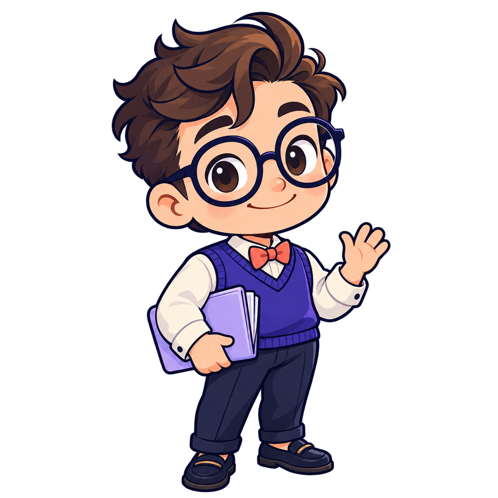
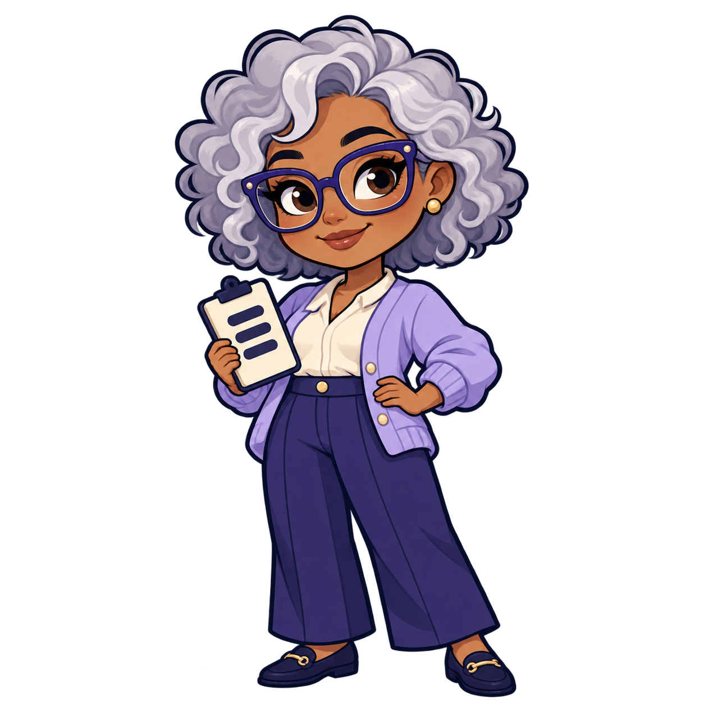
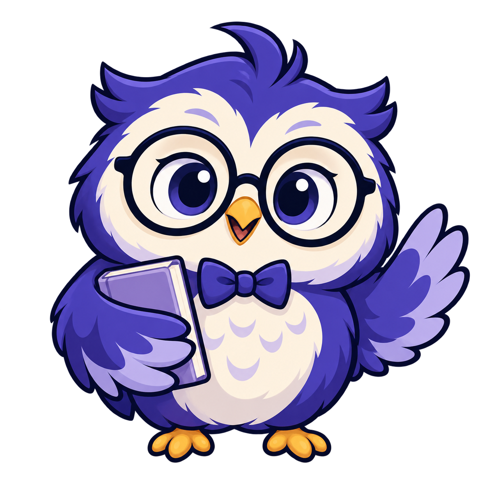
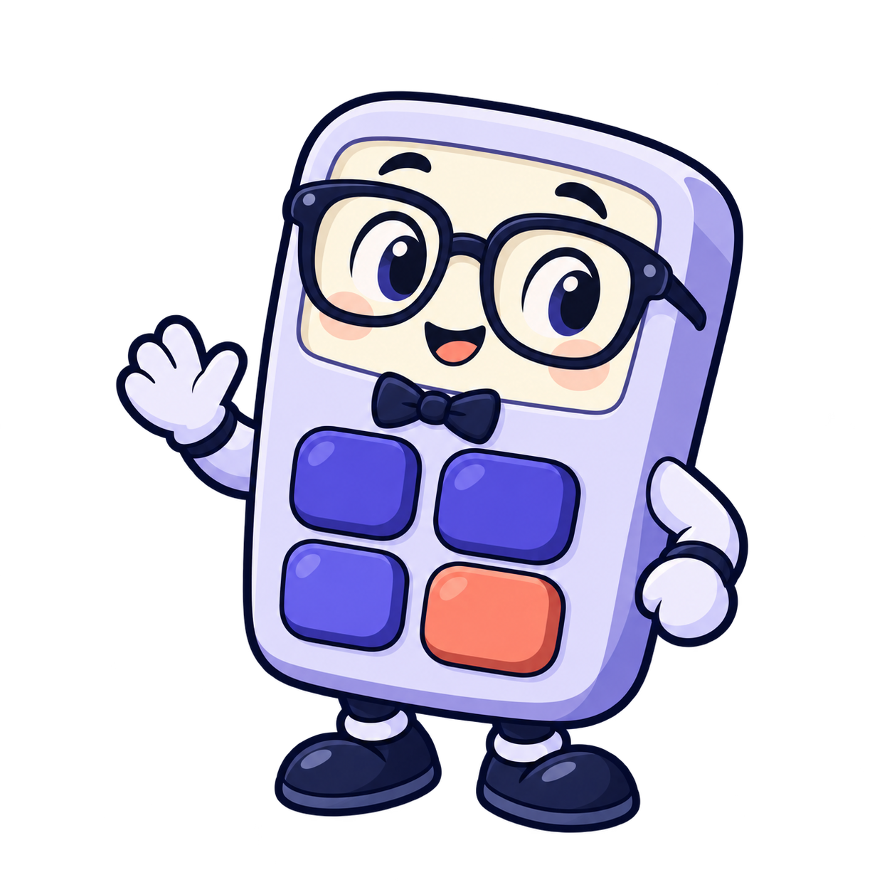

# Mascot concepts

## Selected mascot: Finn

The [Finn animation preview](finn/preview.html) includes eight states and 96 source frames (twelve per state), with gradual entry/exit motion, reduced motion, timing, and frame inspection. Download the [sprite package](finn/finn-sprites.zip), or read the [animation guide](finn/README.md).

## Current review: playful trust and security

Open [review.html](review.html) for five new characters: Finn (consultant), Vera (shield), Scout (owl), Lucky (lock), and Penny (chat bubble). Warm yellow, SD Worx red, and cream dominate; blue appears only in tiny details. All images are transparent PNGs and embedded in the standalone review page.

The [trust generation manifest](trust-generation.json) records filenames and exact prompts, generated with the built-in image_gen tool. The previous blue-led edition is preserved in [review-sdworx.html](review-sdworx.html).

## Previous review: SD Worx colors

Open [review-sdworx.html](review-sdworx.html) for the five regenerated SD Worx color editions, embedded in one standalone HTML file. Each PNG has the `-sdworx.png` suffix. The [generation manifest](sdworx-generation.json) records the exact prompts, references, and official color sources; generated with the built-in image_gen tool.

The current SD Worx logo tokens are blue `#006DD8`, red `#F1002F`, and yellow `#FFBE00`, verified in the [official design-system CSS](https://cdn.sdworx.com/ignite/styling/v2/2.2.0/website/system.css). Character identity and poses are preserved.

The initial concepts and prompts below remain available for comparison, along with [review-original.html](review-original.html).

Five static concept sprites for review, generated with the built-in image_gen tool. These are individual transparent PNGs, not animation sheets. The app is unchanged; select a concept before producing animation poses.

Palette is based on apps/web/src/kennis/kennis.css: indigo, lavender, and navy.

## 01 Pip — the payroll nerd

### Generation prompt

Use case: stylized-concept. Asset type: static 2D mascot sprite concept for the AI chat launcher of Tectonic / SD Trust, a professional payroll knowledge app. Create ONE original isolated mascot, one idle pose, square canvas, genuine transparent background. Crisp polished hand-designed 2D cartoon with bold dark navy outlines, simple flat shapes, very restrained cel shading. Indigo #4338ca, lavender #eceefe, navy #141a33, cream, with small warm accent. Warm, clever, reassuring, nerdy, appropriate for adults at work. Large readable face and strong compact silhouette that still works at 64px. Center entire character with generous 12% transparent margins; no cropped limbs, no background scene, no pedestal, no drop shadow outside the character. No text, labels, letters, logos, watermark, UI frame, or additional characters. Not a sprite sheet yet: exactly one static pose.
Subject: A charming human male payroll consultant with oversized round navy glasses, a distinctive swoop of slightly messy brown hair, warm peach skin, little friendly smile, indigo sweater vest over cream shirt, tiny coral bow tie, stubby navy trousers and loafers. Chibi adult proportions, large head about half height. One hand holds a small lavender payroll folder tucked under arm, other hand gives a small welcoming wave. Full body, front three-quarter view. Glasses and hair form the instantly recognizable signature.

## 02 Ada — the calm expert

### Generation prompt

Use case: stylized-concept. Asset type: static 2D mascot sprite concept for the AI chat launcher of Tectonic / SD Trust, a professional payroll knowledge app. Create ONE original isolated mascot, one idle pose, square canvas, genuine transparent background. Crisp polished hand-designed 2D cartoon with bold dark navy outlines, simple flat shapes, very restrained cel shading. Indigo #4338ca, lavender #eceefe, navy #141a33, cream, with small warm accent. Warm, clever, reassuring, nerdy, appropriate for adults at work. Large readable face and strong compact silhouette that still works at 64px. Center entire character with generous 12% transparent margins; no cropped limbs, no background scene, no pedestal, no drop shadow outside the character. No text, labels, letters, logos, watermark, UI frame, or additional characters. Not a sprite sheet yet: exactly one static pose.
Subject: A friendly nerdy human woman, an experienced senior payroll consultant, warm brown skin, distinctive fluffy silver curly bob, oversized soft-square indigo glasses, confident gentle smile, simple lavender cardigan over cream blouse, indigo wide-leg trousers, small loafers. Chibi adult proportions, large head about half height. Holding one tiny cream payslip clipboard with just three broad abstract navy rows (no text), other hand resting on hip. Full body three-quarter front view. Warm competence, charismatic adult colleague, not a child.

## 03 Otto — the ledger owl

### Generation prompt

Use case: stylized-concept. Asset type: static 2D mascot sprite concept for the AI chat launcher of Tectonic / SD Trust, a professional payroll knowledge app. Create ONE original isolated mascot, one idle pose, square canvas, genuine transparent background. Crisp polished hand-designed 2D cartoon with bold dark navy outlines, simple flat shapes, very restrained cel shading. Indigo #4338ca, lavender #eceefe, navy #141a33, cream, with small warm accent. Warm, clever, reassuring, nerdy, appropriate for adults at work. Large readable face and strong compact silhouette that still works at 64px. Center entire character with generous 12% transparent margins; no cropped limbs, no background scene, no pedestal, no drop shadow outside the character. No text, labels, letters, logos, watermark, UI frame, or additional characters. Not a sprite sheet yet: exactly one static pose.
Subject: A charming round little owl as a nerdy payroll consultant. Cream face disks, plum-indigo body, bold circular navy spectacles, big attentive eyes, tiny amber beak, tidy little indigo bow tie, one little feather tuft like a consultant's cowlick. One wing tucked around a single small lavender ledger book, the other wing raised slightly in a greeting. Two tiny amber feet. Full body facing forward, very compact plump silhouette. Clever and dependable, subtle office personality, not a wizard.

## 04 Cal — the pocket accountant

### Generation prompt

Use case: stylized-concept. Asset type: static 2D mascot sprite concept for the AI chat launcher of Tectonic / SD Trust, a professional payroll knowledge app. Create ONE original isolated mascot, one idle pose, square canvas, genuine transparent background. Crisp polished hand-designed 2D cartoon with bold dark navy outlines, simple flat shapes, very restrained cel shading. Indigo #4338ca, lavender #eceefe, navy #141a33, cream, with small warm accent. Warm, clever, reassuring, nerdy, appropriate for adults at work. Large readable face and strong compact silhouette that still works at 64px. Center entire character with generous 12% transparent margins; no cropped limbs, no background scene, no pedestal, no drop shadow outside the character. No text, labels, letters, logos, watermark, UI frame, or additional characters. Not a sprite sheet yet: exactly one static pose.
Subject: An anthropomorphic pocket calculator as a nerdy payroll consultant. Compact softly rounded vertical lavender calculator body, expressive friendly eyes behind oversized navy glasses in the upper cream display, small smile, four oversized indigo keypad buttons below with one coral key and no printed symbols. Tiny navy bow tie between face and keypad, very short rounded arms and little navy shoes. One arm raised in a small welcoming wave. Full body, slight three-quarter angle. Strong clear calculator silhouette, lovable practical colleague, no robot antenna, no metallic textures.

## 05 Quip — the talking consultant

### Generation prompt

Use case: stylized-concept. Asset type: static 2D mascot sprite concept for the AI chat launcher of Tectonic / SD Trust, a professional payroll knowledge app. Create ONE original isolated mascot, one idle pose, square canvas, genuine transparent background. Crisp polished hand-designed 2D cartoon with bold dark navy outlines, simple flat shapes, very restrained cel shading. Indigo #4338ca, lavender #eceefe, navy #141a33, cream, with small warm accent. Warm, clever, reassuring, nerdy, appropriate for adults at work. Large readable face and strong compact silhouette that still works at 64px. Center entire character with generous 12% transparent margins; no cropped limbs, no background scene, no pedestal, no drop shadow outside the character. No text, labels, letters, logos, watermark, UI frame, or additional characters. Not a sprite sheet yet: exactly one static pose.
Subject: A living plump lavender speech bubble with a small lower-left speech tail, dressed with the personality of a nerdy payroll consultant. Oversized round navy eyeglasses over expressive dark eyes, one simple indigo swoop on top suggesting neatly combed hair, warm smile, tiny coral bow tie near base. Two tiny rounded arms integrated into the sides, one holding a single cream payslip card with two broad abstract indigo rows (no text). No legs. Body is itself a chat bubble, extremely clear rounded silhouette, charming subtly mischievous helpful personality. Flat 2D illustration, not glossy 3D.
